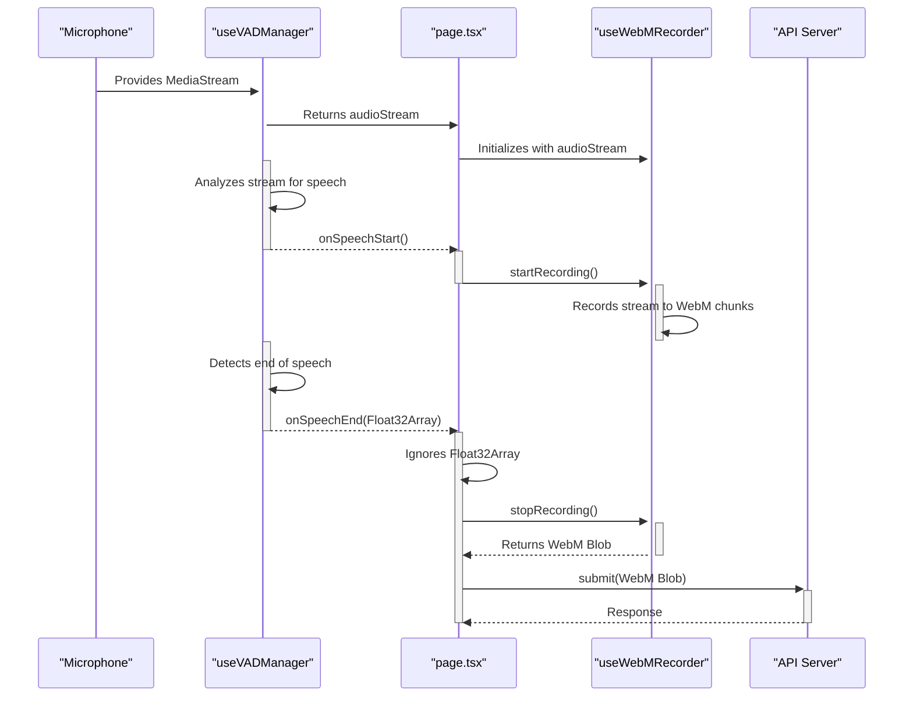
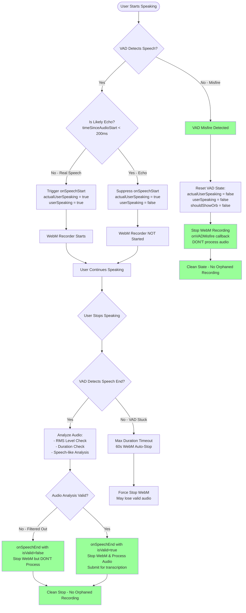

# Hooks Documentation

This directory contains custom React hooks for the Friday voice assistant application.

## VAD (Voice Activity Detection) System

### Overview

The VAD system provides real-time voice activity detection with echo filtering, speech analysis, and automatic management based on authentication and settings.

### Architecture



```mermaid
graph TB
    %% User Actions
    User[User Actions] --> Auth[Authentication]
    User --> Settings[Settings Change]
    User --> Speech[User Speaks]
    User --> Stream[AI Response Streaming]

    %% Main Component
    subgraph "page.tsx - Main Component"
        MainComp[Main Component]
        OnSpeechStart[onSpeechStart Callback]
        OnSpeechEnd[onSpeechEnd Callback]
        VADManagerHook[useVADManager Hook]
    end

    %% VAD Manager Hook
    subgraph "useVADManager.ts - VAD Hook"
        VADHook[useVADManager]
        VADState[VAD State Management]
        AudioStream[Audio Stream Creation]
        MicVAD[useMicVAD Hook]
        SpeechStartHandler[handleSpeechStart]
        SpeechEndHandler[handleSpeechEnd]
        EchoFilter[Echo Filtering]
        SpeechAnalysis[Speech Analysis]
        AutoManagement[Auto Start/Pause]
    end

    %% VAD Library
    subgraph "VAD Library (@ricky0123/vad-react)"
        VADLib[useMicVAD]
        VADWorker[VAD Worker]
        AudioProcessing[Audio Processing]
    end

    %% Audio System
    subgraph "Audio System"
        Microphone[Microphone]
        AudioContext[Web Audio API]
        Player[Audio Player]
    end

    %% Flow Connections
    MainComp --> VADManagerHook
    VADManagerHook --> VADHook

    %% Context Updates
    Auth --> VADHook
    Settings --> VADHook
    Stream --> VADHook

    %% VAD Hook Internal Flow
    VADHook --> VADState
    VADHook --> AudioStream
    VADHook --> MicVAD
    VADHook --> AutoManagement

    %% Audio Stream Creation
    AudioStream --> Microphone
    AudioStream --> AudioContext

    %% MicVAD Integration
    MicVAD --> VADLib
    VADLib --> VADWorker
    VADWorker --> AudioProcessing

    %% Speech Detection Flow
    AudioProcessing --> SpeechStartHandler
    AudioProcessing --> SpeechEndHandler

    %% Speech Start Flow
    SpeechStartHandler --> EchoFilter
    EchoFilter --> OnSpeechStart
    OnSpeechStart --> Player
    Player -.-> |Stop Playback| Stream

    %% Speech End Flow
    SpeechEndHandler --> SpeechAnalysis
    SpeechAnalysis --> OnSpeechEnd
    OnSpeechEnd --> |Submit Audio| API[API Route]

    %% Auto Management
    AutoManagement --> |Start/Pause| VADLib

    %% State Updates
    VADState --> MainComp
    VADWorker --> VADState

    %% Styling
    classDef userAction fill:#e1f5fe
    classDef mainComponent fill:#f3e5f5
    classDef vadHook fill:#e8f5e8
    classDef vadLibrary fill:#fff3e0
    classDef audioSystem fill:#fce4ec

    class User,Auth,Settings,Speech,Stream userAction
    class MainComp,OnSpeechStart,OnSpeechEnd,VADManagerHook mainComponent
    class VADHook,VADState,AudioStream,SpeechStartHandler,SpeechEndHandler,EchoFilter,SpeechAnalysis,AutoManagement vadHook
    class VADLib,VADWorker,AudioProcessing vadLibrary
    class Microphone,AudioContext,Player,API audioSystem
```

### useVADManager Hook

The main VAD hook that provides voice activity detection with automatic management and echo filtering.

#### Usage

```typescript
import { useVADManager } from "@/lib/hooks/useVADManager";

const vadManager = useVADManager(
  {
    // VAD Configuration
    positiveSpeechThreshold: 0.7,
    minSpeechFrames: 6,
    rmsEnergyThreshold: -35,
    minSpeechDuration: 400,
    spectralCentroidThreshold: 1000
  },
  {
    // Callbacks
    onSpeechStart: () => console.log("Speech started"),
    onSpeechEnd: audio => console.log("Speech ended", audio)
  },
  {
    // Context
    isStreaming: false,
    isAuthenticated: true,
    audioEnabled: true
  }
);

// Access VAD state
const { loading, errored, userSpeaking, actualUserSpeaking } = vadManager.state;

// Manual control (usually not needed due to auto-management)
vadManager.start();
vadManager.pause();
```

#### Configuration Options

| Option                      | Type     | Default | Description                             |
| --------------------------- | -------- | ------- | --------------------------------------- |
| `positiveSpeechThreshold`   | `number` | `0.7`   | Threshold for positive speech detection |
| `minSpeechFrames`           | `number` | `6`     | Minimum number of frames for speech     |
| `rmsEnergyThreshold`        | `number` | `-35`   | RMS energy threshold in dBFS            |
| `minSpeechDuration`         | `number` | `400`   | Minimum speech duration in ms           |
| `spectralCentroidThreshold` | `number` | `1000`  | Spectral centroid threshold in Hz       |

#### Context Options

| Option            | Type      | Description                             |
| ----------------- | --------- | --------------------------------------- |
| `isStreaming`     | `boolean` | Whether AI is currently streaming audio |
| `isAuthenticated` | `boolean` | Whether user is authenticated           |
| `audioEnabled`    | `boolean` | Whether audio features are enabled      |

#### State Properties

| Property             | Type      | Description                             |
| -------------------- | --------- | --------------------------------------- |
| `loading`            | `boolean` | Whether VAD is initializing             |
| `errored`            | `boolean` | Whether VAD has encountered an error    |
| `userSpeaking`       | `boolean` | Whether user is speaking (UI indicator) |
| `actualUserSpeaking` | `boolean` | Raw speech detection (for logic)        |

### Key Flow Patterns

#### 1. Initialization Flow

```
Main Component → useVADManager → Audio Stream → useMicVAD → VAD Worker
```

#### 2. Speech Start Flow

```
User Speaks → VAD Detection → Echo Filter → onSpeechStart → Stop Playback
```

#### 3. Speech End Flow

```
User Stops → VAD Detection → Speech Analysis → onSpeechEnd → Submit to API
```

#### 4. Context Management

```
Auth/Settings Change → useVADManager → Auto Start/Pause → VAD Worker
```

#### 5. State Updates

```
VAD Worker → VAD State → Main Component → UI Updates
```

### Features

#### ✅ **Single VAD Instance**

- Guaranteed single VAD instance per application
- No duplicate initialization or memory leaks
- Clean lifecycle management

#### ✅ **Automatic Management**

- Auto-starts when authenticated and audio enabled
- Auto-pauses when unauthenticated or audio disabled
- Respects streaming state for echo prevention

#### ✅ **Echo Prevention**

- Filters out speech detection during AI audio playback
- Prevents feedback loops from speakers
- Smart timing-based echo detection

#### ✅ **Speech Analysis**

- Multi-layer speech filtering
- RMS energy analysis
- Spectral centroid analysis
- Duration-based filtering

#### ✅ **Error Handling**

- Graceful error recovery
- Automatic retry mechanisms
- Proper cleanup on errors

#### ✅ **Audio Stream Management**

- Enhanced audio stream with noise suppression
- Automatic stream cleanup
- Proper microphone permissions handling

### Browser Compatibility

#### Firefox-Specific Handling

- Special restart logic for Firefox VAD issues
- Timeout-based recovery mechanisms
- Enhanced error handling for Firefox quirks

#### Chrome/Safari

- Standard VAD behavior
- Optimal performance and reliability

### Performance Considerations

#### Memory Management

- Automatic cleanup of audio streams
- Proper event listener cleanup
- No memory leaks from VAD instances

#### CPU Usage

- Efficient audio processing
- Minimal overhead during idle state
- Optimized speech analysis algorithms

### Debugging

#### Logging

- Comprehensive console logging for all VAD events
- Speech analysis metrics logging
- State transition logging

#### Common Issues

1. **VAD not starting**: Check authentication and audio permissions
2. **Echo detection**: Verify streaming state and timing
3. **Performance issues**: Check audio stream configuration
4. **Firefox issues**: Look for specific Firefox error patterns

```typescript
const vadManager = useVADManager(config, callbacks, context);
const vadState = vadManager.state;

// Automatic lifecycle management - no manual useEffect needed
```

### Benefits

✅ **Simplified Architecture**: Single hook with clear responsibilities
✅ **Automatic Management**: No manual lifecycle management needed
✅ **Better Performance**: Reduced re-renders and optimized state management
✅ **Improved Reliability**: Better error handling and recovery
✅ **Cleaner Code**: Reduced complexity and boilerplate
✅ **Better Testing**: Easier to test and debug

## WebM Recorder System

### Overview

The `useWebMRecorder` hook provides a simple and efficient way to record audio directly from a `MediaStream` into the WebM format using the browser's native `MediaRecorder` API. It is designed to work in tandem with the `useVADManager` hook to capture user speech for processing by the backend.

### Architecture

The recorder is initialized with the same `MediaStream` used by the VAD. It operates in parallel, waiting for signals from the VAD callbacks (`onSpeechStart` / `onSpeechEnd`) to start and stop recording. This approach leverages the browser's highly optimized, native encoding capabilities, ensuring minimal performance impact on the application.



### How It Works

1.  **Initialization**: The hook receives a `MediaStream` (typically from `useVADManager`). It checks for browser support for `MediaRecorder` and the desired `audio/webm` MIME type.
2.  **`startRecording()`**: When called (usually in the `onSpeechStart` callback), it clears any previous recordings, resets timers, and calls `mediaRecorder.start()`.
3.  **Data Collection**: The `MediaRecorder` emits `dataavailable` events at regular intervals (`timeSlice`). The hook collects these `Blob` chunks in an array.
4.  **`stopRecording()`**: When called (usually in the `onSpeechEnd` callback), it calls `mediaRecorder.stop()`.
5.  **Finalization**: On the `stop` event, it combines all collected chunks into a single WebM `Blob`, validates its size, and returns the `Blob` via a `Promise`.

### Usage

```typescript
import { useWebMRecorder } from "@/lib/hooks/useWebMRecorder";

// Get audioStream from useVADManager
const vadManager = useVADManager(...);
const webmRecorder = useWebMRecorder(vadManager.audioStream, {
    maxDuration: 30000, // 30 seconds
    minBlobSize: 1024, // 1KB
});

// In VAD's onSpeechStart callback:
webmRecorder.startRecording();

// In VAD's onSpeechEnd callback:
const webmBlob = await webmRecorder.stopRecording();
if (webmBlob) {
    // submit blob to server
}
```

### Configuration Options

| Option               | Type     | Default                    | Description                                              |
| -------------------- | -------- | -------------------------- | -------------------------------------------------------- |
| `mimeType`           | `string` | `'audio/webm;codecs=opus'` | The MIME type for the recording.                         |
| `audioBitsPerSecond` | `number` | `128000`                   | The target audio bitrate in bits per second.             |
| `timeSlice`          | `number` | `100`                      | The interval (in ms) for chunking the recording.         |
| `maxDuration`        | `number` | `60000`                    | Maximum recording duration in ms before auto-stopping.   |
| `minBlobSize`        | `number` | `1024`                     | Minimum valid blob size in bytes to be considered valid. |

### State Properties

| Property            | Type             | Description                                  |
| ------------------- | ---------------- | -------------------------------------------- |
| `isRecording`       | `boolean`        | Whether the recorder is currently active.    |
| `isAvailable`       | `boolean`        | Whether `MediaRecorder` is supported.        |
| `error`             | `string \| null` | Any error message that occurred.             |
| `recordingDuration` | `number`         | The current duration of the recording in ms. |
| `blobSize`          | `number`         | The size of the last recorded blob in bytes. |

### Methods

| Method           | Signature                     | Description                                                                  |
| ---------------- | ----------------------------- | ---------------------------------------------------------------------------- |
| `startRecording` | `() => void`                  | Begins the recording process.                                                |
| `stopRecording`  | `() => Promise<Blob \| null>` | Stops the recording and returns the final `Blob`, or `null` if it's invalid. |

### Key Features

#### ✅ **Native Performance**

- Leverages the browser's built-in `MediaRecorder` for efficient, hardware-accelerated encoding.
- Avoids CPU-intensive JavaScript audio processing, ensuring a smooth UI.

#### ✅ **Simple API**

- A clean and straightforward interface with `startRecording` and `stopRecording` methods.
- Handles all the internal complexity of chunking, timing, and blob creation.

#### ✅ **Robust Error Handling**

- Includes checks for browser support and handles recorder errors gracefully.
- Validates the final audio blob size to prevent sending empty or invalid recordings.

#### ✅ **Configurability**

- Allows customization of MIME type, bitrate, and recording duration limits to suit different needs.

## VAD and WebM Recording Flow

### Overview

This section documents the complete flow between the VAD (Voice Activity Detection) system and WebM recording, including recent improvements that resolved critical issues with orphaned recordings and state synchronization.

### Complete Flow Diagram



### Recent Improvements

#### ✅ **Enhanced onSpeechEnd Callback**

**Before:**

```typescript
onSpeechEnd?: (audio: Float32Array) => void;
```

**After:**

```typescript
onSpeechEnd?: (isValid: boolean, audio: Float32Array) => void;
```

The callback now receives an `isValid` flag that indicates whether the VAD analysis determined the audio contains valid speech. This enables the main component to properly handle both valid and invalid audio scenarios.

#### ✅ **Improved VAD Misfire Handling**

**Before:**

- VAD misfires left WebM recordings running indefinitely
- No mechanism to stop orphaned recordings
- Inconsistent state between VAD and WebM recorder

**After:**

- VAD misfires properly stop WebM recording via `onVADMisfire` callback
- Audio data is discarded appropriately for false positives
- Clean state management prevents orphaned recordings

#### ✅ **Better Audio Filtering Integration**

**Before:**

- Filtered audio left WebM recorder running with no cleanup
- `onSpeechEnd` was not called for invalid audio
- Manual cleanup required or timeout dependency

**After:**

- `onSpeechEnd(false, audio)` called for filtered audio
- WebM recorder stopped even when audio is deemed invalid
- Consistent cleanup across all audio processing paths

### Resolved Issues

#### 🚫 **Orphaned WebM Recordings** → ✅ **Fixed**

**Problem:** VAD misfires and filtered audio scenarios left WebM recordings running indefinitely with no proper cleanup mechanism.

**Solution:** All flow paths now properly stop the WebM recorder:

- Valid speech: `onSpeechEnd(true, audio)` → stops WebM and processes audio
- Invalid speech: `onSpeechEnd(false, audio)` → stops WebM but discards audio
- VAD misfire: `onVADMisfire()` → stops WebM and discards audio
- Timeout: Max duration limit → stops WebM (backup safety)

#### 🚫 **State Synchronization Issues** → ✅ **Fixed**

**Problem:** VAD state and WebM recorder state were loosely coupled, leading to inconsistent states where VAD would reset but WebM would continue recording.

**Solution:** The `isValid` flag provides tight coupling between VAD analysis results and WebM cleanup decisions, ensuring synchronized state management.

#### 🚫 **Audio Interruption on False Positives** → ✅ **Fixed**

**Problem:** VAD misfires would stop audio playback unnecessarily, interrupting AI responses during false positive detections.

**Solution:** VAD misfires now only reset visual state without stopping audio playback, while still properly cleaning up WebM recordings.

### Flow Scenarios

#### Scenario 1: Valid Speech Detection

```
User Speaks → VAD Detects → Start WebM → User Stops → Audio Analysis (Valid)
→ onSpeechEnd(true, audio) → Stop WebM → Process Audio → Submit to API
```

#### Scenario 2: Invalid Audio (Filtered)

```
User Speaks → VAD Detects → Start WebM → User Stops → Audio Analysis (Invalid)
→ onSpeechEnd(false, audio) → Stop WebM → Discard Audio
```

#### Scenario 3: VAD Misfire

```
False Detection → VAD Misfire → Reset VAD State → onVADMisfire()
→ Stop WebM → Discard Audio → Clean State
```

#### Scenario 4: Echo Detection

```
AI Audio Playing → User Speech Detected → Echo Filter → Suppress Recording
→ No WebM Start → Continue Normal Flow
```

### Testing Scenarios

When testing the VAD and WebM integration, verify these scenarios:

1. **Normal Speech Flow**: Ensure valid speech is properly recorded and submitted
2. **Short Speech Filtering**: Verify short sounds are filtered but WebM stops cleanly
3. **VAD Misfire Recovery**: Test that misfires don't leave orphaned recordings
4. **Echo Prevention**: Ensure AI audio doesn't trigger false speech detection
5. **Long Recording Timeout**: Verify 60-second timeout properly stops recording
6. **State Consistency**: Check that VAD and WebM states remain synchronized

### Performance Characteristics

- **Clean Termination**: All flow paths result in proper WebM recorder cleanup
- **No Memory Leaks**: Eliminated orphaned MediaRecorder instances
- **Consistent State**: VAD and WebM states remain synchronized across all scenarios
- **Responsive UI**: VAD misfires don't interrupt user experience unnecessarily
