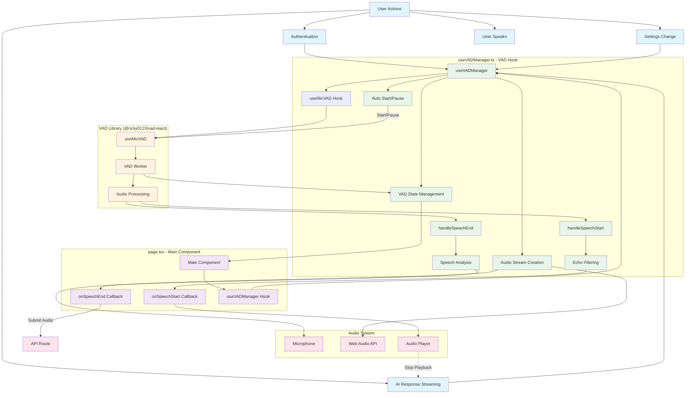

# Hooks Documentation

This directory contains custom React hooks for the Friday voice assistant application.

## VAD (Voice Activity Detection) System

### Overview

The VAD system provides real-time voice activity detection with echo filtering, speech analysis, and automatic management based on authentication and settings.

### Architecture



### useVADManager Hook

The main VAD hook that provides voice activity detection with automatic management and echo filtering.

#### Usage

```typescript
import { useVADManager } from "@/lib/hooks/useVADManager";

const vadManager = useVADManager(
  {
    // VAD Configuration
    positiveSpeechThreshold: 0.7,
    minSpeechFrames: 6,
    rmsEnergyThreshold: -35,
    minSpeechDuration: 400,
    spectralCentroidThreshold: 1000
  },
  {
    // Callbacks
    onSpeechStart: () => console.log("Speech started"),
    onSpeechEnd: (audio) => console.log("Speech ended", audio)
  },
  {
    // Context
    isStreaming: false,
    isAuthenticated: true,
    audioEnabled: true
  }
);

// Access VAD state
const { loading, errored, userSpeaking, actualUserSpeaking } = vadManager.state;

// Manual control (usually not needed due to auto-management)
vadManager.start();
vadManager.pause();
```

#### Configuration Options

| Option | Type | Default | Description |
|--------|------|---------|-------------|
| `positiveSpeechThreshold` | `number` | `0.7` | Threshold for positive speech detection |
| `minSpeechFrames` | `number` | `6` | Minimum number of frames for speech |
| `rmsEnergyThreshold` | `number` | `-35` | RMS energy threshold in dBFS |
| `minSpeechDuration` | `number` | `400` | Minimum speech duration in ms |
| `spectralCentroidThreshold` | `number` | `1000` | Spectral centroid threshold in Hz |

#### Context Options

| Option | Type | Description |
|--------|------|-------------|
| `isStreaming` | `boolean` | Whether AI is currently streaming audio |
| `isAuthenticated` | `boolean` | Whether user is authenticated |
| `audioEnabled` | `boolean` | Whether audio features are enabled |

#### State Properties

| Property | Type | Description |
|----------|------|-------------|
| `loading` | `boolean` | Whether VAD is initializing |
| `errored` | `boolean` | Whether VAD has encountered an error |
| `userSpeaking` | `boolean` | Whether user is speaking (UI indicator) |
| `actualUserSpeaking` | `boolean` | Raw speech detection (for logic) |

### Key Flow Patterns

#### 1. Initialization Flow
```
Main Component → useVADManager → Audio Stream → useMicVAD → VAD Worker
```

#### 2. Speech Start Flow
```
User Speaks → VAD Detection → Echo Filter → onSpeechStart → Stop Playback
```

#### 3. Speech End Flow
```
User Stops → VAD Detection → Speech Analysis → onSpeechEnd → Submit to API
```

#### 4. Context Management
```
Auth/Settings Change → useVADManager → Auto Start/Pause → VAD Worker
```

#### 5. State Updates
```
VAD Worker → VAD State → Main Component → UI Updates
```

### Features

#### ✅ **Single VAD Instance**
- Guaranteed single VAD instance per application
- No duplicate initialization or memory leaks
- Clean lifecycle management

#### ✅ **Automatic Management**
- Auto-starts when authenticated and audio enabled
- Auto-pauses when unauthenticated or audio disabled
- Respects streaming state for echo prevention

#### ✅ **Echo Prevention**
- Filters out speech detection during AI audio playback
- Prevents feedback loops from speakers
- Smart timing-based echo detection

#### ✅ **Speech Analysis**
- Multi-layer speech filtering
- RMS energy analysis
- Spectral centroid analysis
- Duration-based filtering

#### ✅ **Error Handling**
- Graceful error recovery
- Automatic retry mechanisms
- Proper cleanup on errors

#### ✅ **Audio Stream Management**
- Enhanced audio stream with noise suppression
- Automatic stream cleanup
- Proper microphone permissions handling

### Browser Compatibility

#### Firefox-Specific Handling
- Special restart logic for Firefox VAD issues
- Timeout-based recovery mechanisms
- Enhanced error handling for Firefox quirks

#### Chrome/Safari
- Standard VAD behavior
- Optimal performance and reliability

### Performance Considerations

#### Memory Management
- Automatic cleanup of audio streams
- Proper event listener cleanup
- No memory leaks from VAD instances

#### CPU Usage
- Efficient audio processing
- Minimal overhead during idle state
- Optimized speech analysis algorithms

### Debugging

#### Logging
- Comprehensive console logging for all VAD events
- Speech analysis metrics logging
- State transition logging

#### Common Issues
1. **VAD not starting**: Check authentication and audio permissions
2. **Echo detection**: Verify streaming state and timing
3. **Performance issues**: Check audio stream configuration
4. **Firefox issues**: Look for specific Firefox error patterns

### Migration from useVADWithOrbControl

The old `useVADWithOrbControl` hook has been replaced with `useVADManager`. Key differences:

#### Before (Complex)
```typescript
const vad = useVADWithOrbControl({
  onSpeechStart,
  onSpeechEnd,
  isStreaming: chatState.isStreaming,
  isAuthenticated: auth.isAuthenticated,
  audioEnabled: settings.audioEnabled,
  // ... 8 more config options
});

// Complex state management
const vadState = {
  loading: vad.loading,
  errored: vad.errored,
  userSpeaking: vad.userSpeaking
};

// Manual lifecycle management
useEffect(() => {
  // Complex logic for starting/stopping VAD
}, [/* many dependencies */]);
```

#### After (Simple)
```typescript
const vadManager = useVADManager(config, callbacks, context);
const vadState = vadManager.state;

// Automatic lifecycle management - no manual useEffect needed
```

### Benefits

✅ **Simplified Architecture**: Single hook with clear responsibilities
✅ **Automatic Management**: No manual lifecycle management needed
✅ **Better Performance**: Reduced re-renders and optimized state management
✅ **Improved Reliability**: Better error handling and recovery
✅ **Cleaner Code**: Reduced complexity and boilerplate
✅ **Better Testing**: Easier to test and debug